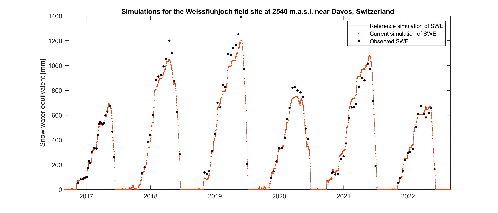
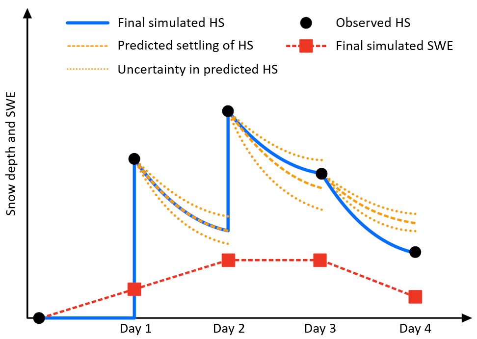

# HS2SWE

Model for converting gap-free snow depth (HS) recordings to snow water equivalent (SWE) without additional inputs such as meteorological data. The model has been developed and tested using daily observations sofar and is currently implemented in the Matlab programming language.

## Example for running the model

The following example reads snow measurements from the Weissfluhjoch field site, runs the HS2SWE model, and finally displays the results:

```matlab
% Clear workspace

close all; clear; home;

% Load data

data_wfj = readtable("data\data_weissfluhjoch.txt");

% Run HS2SWE

swe_sim = HS2SWE(data_wfj.hs_obs);

% Plot results

figure('Units','centimeters','Position',[4 4 28 12])
plot(data_wfj.time,data_wfj.swe_ref,'Color','#808080',DisplayName="Reference simulation of SWE")
hold on
plot(data_wfj.time,swe_sim,'.','Color','#f54209',DisplayName="Current simulation of SWE")
plot(data_wfj.time,data_wfj.swe_obs,'.','Color','#1e0000','MarkerSize',12,DisplayName="Observed SWE")
ylabel("Snow water equilvalent [mm]")
legend()
title("Simulations for the Weissfluhjoch field site at 2540 m.a.s.l. near Davos, Switzerland")
```

The example demonstrates that for Weissfluhjoch, the simulation closely matches the biweekly SWE observations in most years. It is important to note that the SWE measurements are taken a few meters away from the HS recordings used to run HS2SWE. This difference in location contributes to the discrepancies between the observed and simulated SWE values. Additionally, a reference simulation is available in the Weissfluhjoch dataset provided in this repository, allowing users to verify that their simulations are consistent with those performed using Matlab 2023b.



## Model description

The HS2SWE method is based on the concept presented by Martinec and Rango (1991) which describes accumulation, densification and melt of the snowpack layer-by-layer. The only input to the model is the observed daily HS. The HS2SWE model has been in operational use for snow-hydrological forecasting in Switzerland for over a decade. HS2SWE simulation results have been used for assimilation into a temperature-index snow melt model (Magnusson et al., 2014) and for improving spatial snowfall fields (Mott et al., 2023). Unlike empirical regression models relating SWE to HS (e.g., Hill et al., 2019; Jonas et al., 2009), the HS2SWE model provides realistic and continuous SWE estimates.

### Hypothetical simulation example

HS2SWE operates by simulating the evolution of the snowpack, layer-by-layer, where each layer is defined by its density and thickness. The model forecasts compaction for each layer and adapts the snowpack layering through accumulation, densification, or melting, depending on the difference between the predicted and observed HS. We illustrate the simulation process of the HS2SWE model through a hypothetical four-day  scenario encompassing all relevant model steps. On day 1, we introduce the creation of the initial snow layer. Day 2 showcases subsequent accumulation events. Day 3 demonstrates snow settling and the management of compaction and measurement uncertainties. Finally, on day 4, we depict how the model handles snowmelt. This simulation process is detailed and visualized in the figure below.

**Day 1**: An initial layer of snow forms upon the first observation of HS above zero. This layer mirrors the measured thickness and adopts the density characteristic of fresh snow, a calibrated parameter within the model. The mass of this layer is thus calculated based on its observed thickness and estimated new snow density.

**Day 2**: The densification of the initial snow layer formed on day one is forecasted using the Sturm and Holmgren (1998) model, augmented with an empirically derived correction term:

$$ \rho_{i+1} = \rho_{i} + \frac{\sigma}{\eta_0 e^{c_5 \rho_i}} \rho_i \Delta t + c_1 e^{- c_3 \Delta \rho_i}$$

Here, $i$ represents a time index [-], $\rho$ denotes the layer density [kg m<sup>-3</sup>], $\sigma$ signifies the overburden load [Pa], $\eta_0$ stands for a viscosity parameter [Pa s], $\Delta\rho$ indicates the density difference between the layer and fresh snow (constrained to positive values) [kg m<sup>-3</sup>], and $\Delta t$ represents the time step [s]. Additionally, the equation includes three parameters c<sub>1</sub> [kg m<sup>-3</sup>], c<sub>3</sub> [m<sup>3</sup> kg<sup>-1</sup>], and c<sub>5</sub> [m<sup>3</sup> kg<sup>-1</sup>].

Upon reaching day two, the observed HS exceeds the predicted HS after settling (including uncertainty bounds). In this situation, an additional snow layer is introduced. Its thickness equals the difference between observed and predicted HS and adopts the density of fresh snow.

**Day 3**: On day three, the predicted HS falls slightly below the observed HS, but within the range of expected variation in settling velocity, and we employ an iterative approach to fine-tune snow densification for all snow layers. To this end, the latter two terms in the equation above undergoes a modification by multiplying or dividing the densification rates by a correction factor. This factor, starting at 1.0, is increased in successive steps of 0.1 until either the measured HS is matched, a maximum snow density is reached, or a maximum number of 50 iterations is attained. During this iterative process on day three, the observed HS is achieved, thereby maintaining the mass of the snowpack unchanged.

**Day 4**: On the final day of our illustrative sequence, the observed HS drops below the predicted HS, even after increasing snow settling using the iterative adjustments of compaction rates as outlined in the description of day three. In such cases, the top layers of the simulated snowpack are removed until the measured HS is reached. The algorithm also allows only parts of snow layers to be removed if the difference between observed and predicted HS does not align with layer boundaries. The amount of snowmelt is calculated from the thicknesses and densities of the snow layers that were removed. Thus, melt is predicted in case of strong declines in observed HS, or when the maximum density of all layers is reached.



Figure. Schematic illustrating a hypothetical four-day simulation scenario encompassing the creation of an initial snow layer (day 1), subsequent snow accumulation (day 2), snow settling including uncertainty (day 3), and melting (day 4) as simulated by the HS2SWE model.

## References

Hill, D. F., Burakowski, E. A., Crumley, R. L., Keon, J., Hu, J. M., Arendt, A. A., Jones, K. W., & Wolken, G. J. (2019). Converting snow depth to snow water equivalent using climatological variables. Cryosphere, 13(7), 1767-1784. https://doi.org/10.5194/tc-13-1767-2019

Jonas, T., Marty, C., & Magnusson, J. (2009). Estimating the snow water equivalent from snow depth measurements in the Swiss Alps. Journal of Hydrology, 378(1-2), 161-167. https://doi.org/10.1016/j.jhydrol.2009.09.021 

Magnusson, J., Gustafsson, D., Hüsler, F., & Jonas, T. (2014). Assimilation of point SWE data into a distributed snow cover model comparing two contrasting methods. Water Resources Research, 50(10), 7816-7835. https://doi.org/10.1002/2014wr015302

Martinec, J., & Rango, A. (1991). Indirect Evaluation of Snow Reserves in Mountain Basins. In H. Bergmann, H. Lang, W. Frey, D. Issler, & B. Salm,  Snow, Hydrology and Forests in High Alpine Areas, Vienna.

Mott, R., Winstral, A., Cluzet, B., Helbig, N., Magnusson, J., Mazzotti, G., Quéno, L., Schirmer, M., Webster, C., & Jonas, T. (2023). Operational snow-hydrological modeling for Switzerland. Frontiers in Earth Science, 11. https://doi.org/10.3389/feart.2023.1228158

Sturm, M., & Holmgren, J. (1998). Differences in compaction behavior of three climate classes of snow. Annals of Glaciology, Vol 26, 1998, 26, 125-130. https://doi.org/10.3189/1998AoG26-1-125-130 